# git 工作实战分享

## 前言

一般会有同学疑问？

咿？git还有啥工作实战分享？来来去去不就是几个命令吗？

```
git pull // 获取最新线上代码
git checkout -b feat/XXX // 切新开发分支
====开发====
git add . // 添加代码到暂存区
git commit -m "注释 写给自己看或者是领导看" // 提交最好是加注释 防止万一
git push // 推送远程
```

单人开发或者多人无冲突开发，这几个命令够用了。

但是出现突发情况需要你处理，比如出现冲突不想合并，误操作合错分支（把test代码合到开发分支），线上代码回滚等待其他情况。

还比如：一顿操作猛如虎，各种git add，各种git commit，最后一看，我擦，还特么在master/test上，太吓人了，这咋办？——撤销commit：

这时候大脑就会出现灵魂三问。

我是谁？

我在哪？

我在做什么？

git真到那么简单吗？

## git简介

Git是一个开源的分布式版本控制系统，可以有效、高速地处理从很小到非常大的项目版本管理。

### git的由来
Linus Torvalds ，这个人我相信大家都知道吧，开源 Linux 系统的发明人。

如今，你看到的大部分服务器其实都是运行在 Linux 系统上，令人感到称叹的是，这位大神级别的程序员不仅创造了 Linux  系统。

那 Linux 的代码是如何管理的呢？2002年之前，世界各地的志愿者把源代码文件通过 diff 的方式发给 Linus，然后由 Linus 本人通过手工方式合并代码！要知道，当时的 Linux 的代码量已经很大了，通过人工管理的方式，一是容易出错，二是效率低。

于是 Linus 选择了一个商业的版本控制系统 BitKeeper，BitKeeper 的东家 BitMover 公司出于人道主义精神，授权 Linux 社区免费使用这个版本控制系统。最后，出于某种原因，BitMover 公司收回了 Linux 社区的免费使用权，

于是 Linus 花了两周时间自己用 C 语言 写了一个分布式版本控制系统，这就是 Git 的由来了。


## 为什么要用git

首先需要了解什么是集中式和分布式版本控制系统

### 集中式和分布式版本控制系统的概念

集中式的版本控制系统：CVS及SVN；

集中式版本控制系统：

> 1. 版本库是集中存放在中央服务器的
> 2. 干活的时候，用的都是自己的电脑，所以要先从中央服务器取得最新的版本，然后开始干活，干完活了，再把自己的活推送给中央服务器。
> 3. 中央服务器就好比是一个图书馆，你要改一本书，必须先从图书馆借出来，然后回到家自己改，改完了，再放回图书馆。

优点：每个人都可以一定程度上看到项目中的其他人正在做些什么。而管理员也可以轻松掌控每个开发者的权限。

缺点：必须联网（局域网）才能工作，中央服务器的单点故障，故障期间谁都无法提交更新、还原、对比等。

分布式版本控制系统：
> 1. 分布式版本控制系统根本没有“中央服务器”，每个人的电脑上都是一个完整的版本库,所以你不需要联网；
> 2. 那多个人如何协作呢？比方说你在自己电脑上改了文件A，你的同事也在他的电脑上改了文件A，这时，你们俩之间只需把各自的修改推送给对方，就可以互相看到对方的修改了；
> 3. 现实中，分布式版本控制系统通常也有一台充当“中央服务器”的电脑，但这个服务器的作用仅仅是用来方便“交换”大家的修改，没有它大家也一样干活，只是交换修改不方便而已；

优点：无需联网，强大的分支管理等（ SVN 分支是拷贝的目录，Git 分支是指针指向某次提交，这个特性使 Git 的分支切换非常迅速，且创建成本非常低）；

缺点：Git复杂概念和命令多，对新手不太友好；

## git的工作区域和流程

Git 最核心的一个概念就是工作流。

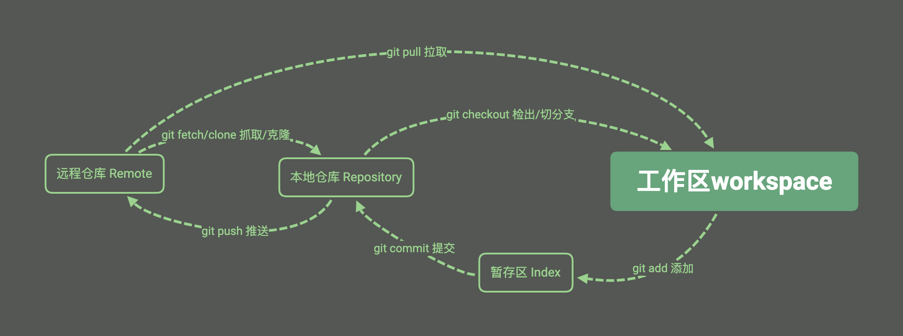

> * 工作区(Workspace) 就是平时进行开发改动的地方，是当前看到最新的内容，在开发的过程也就是对工作区的操作。
> * 暂存区(Index) 当执行 `git add` 的命令后，工作区的文件就会被移入暂存区，暂存区标记了当前工作区中那些内容是被 Git 管理的，当完成某个需求或者功能后需要提交代码，第一步就是通过 `git add` 先提交到暂存区。
> * 本地仓库区(Repository) 位于自己的电脑上，通过 git commit 提交暂存区的内容，会进入本地仓库。
> * 远程仓库(Remote) 用来托管代码的服务器，远程仓库的内容能够被分布在多个地点的处于协作关系的本地仓库修改，本地仓库修改完代码后通过 git push 命令同步代码到远程仓库,可以理解为目的是为了协调统一多个本地仓库代码的中转站；


另一种理解方式，git内部文件有三种状态：已修改（modified）、已暂存（staged）、已提交（committed）；

> * 已修改表示修改了某个文件，但还没有提交保存;
> * 已暂存表示把已修改的文件放在下次提交时要保存的清单中;
> * 已提交表示该文件已经被安全地保存在本地数据库中了;

由此我们看到 Git 管理项目时，文件流转的三个工作区域：Git 的工作目录，暂存区域，以及本地仓库。

最后`git push`推送命令，就是将本地仓库变更记录推到远程仓库，保持一致；

通常提交代码分为几步：
> * 在工作区开发，添加，修改文件;
> * git add 从工作区提交到暂存区;
> * git commit 从暂存区提交到本地仓库;
> * git push 从本地仓库提交到远程仓库;

一般来说，记住以下命令，便可进行日常工作了

## 业务中使用git解决问题场景

### git fetch(获取)

与 git pull 不同的是 git fetch 操作仅仅只会拉取远程的更改，不会自动进行 merge 操作。对你当前的代码没有影响

```
# 获取远程仓库特定分支的更新
git fetch <远程主机名> <分支名>
# 获取远程仓库所有分支的更新
git fetch --all

```

### git pull 和git pull --rebase 使用

场景1: A同学和B同学同时在分支`feat/demo1`分支开发代码，A同学开发完代码先提交，B同学后开发完代码提交代码，git报错了，提醒我们远程分支有新的commit未同步到本地，无法推送？

解决方案1: 执行`git pull`,同步远程分支到本地，再提交；

解决方案2: 执行`git pull --rebase`,同步远程分支到本地，再提交；

对比提交记录：
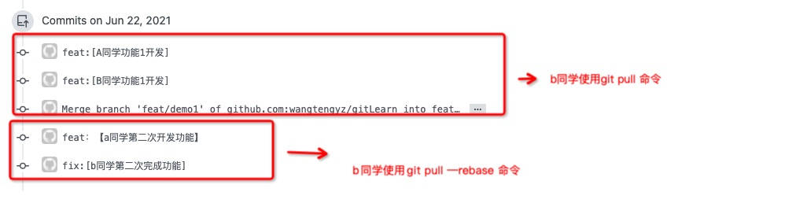

注意事项： 
* 执行 git pull --rebase 的时候必须保持本地目录干净;
* 如果出现冲突，可以选择手动解决冲突后继续 rebase，也可以放弃本次 rebase;

解决问题：
> git add 冲突文件   
> git rebase --continue

放弃：

> git rebase --abort

总结： 
多人基于同一个远程分支开发的时候，如果想要顺利 push 又不自动生成 merge commit，可以使用`git pull --rebase`命令，再执行`git push`；

tips：
1. `git pull` 等同于 `git fetch && git merge`;
2. `git pull rebase` 等同于`git fetch && git rebase`
### Git merge和rebase分支合并命令的区别

一般咱们开发过程中，把一个分支的修改合并到当前分支上，有两种方式`git merge`和`git rebase`(变基)；

#### git merge(合并)

git merge中有两个合并策略：fast-forward(默认) 和 no-fast-forward。

fast-forward：如果当前分支，在合并分支前，没有做过额外提交。那么合并分支的过程不会产生的新的提交记录，而是直接将分支上的提交添加进来。


no-fast-forward：多人在协调开发时常遇到，两个分支对于同一段内容修改，就会触发 no-fast-forward 策略；


#### git rebase（变基）

`git rebase` 指令会`复制`当前分支的所有最新提交，然后将这些提交添加到指定分支提交记录之上;


业务场景演示：

1. main开出分支feat/b开发新增b.js;
2. main出现紧急情况修复新增c.js;
3. 执行 `git rebase mian `指令后，feat/b分支将自己的最新提交记录复制出来（提交 hash 也发生了改变），拼在了主分支最后一次提交之上;

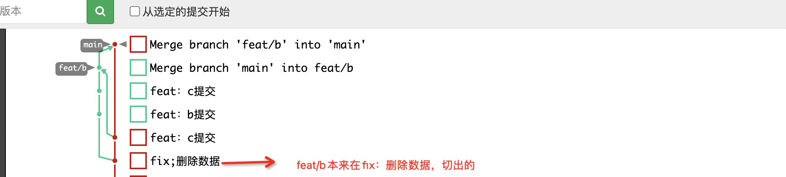

变基在开发功能（feature branch）分支时很有用——在开发功能时，主分支上可能也做了一些更新，我们可以将主分支上的最新更新通过变基合并到功能分支上来，这在未来在主分支上合并功能分支避免了冲突的发生。

区别：

* 解决冲突的时候，用 merge 只需要解决一次冲突即可，简单粗暴;
* 而用 rebase 的时候 ，需要依次解决每次的冲突，才可以提。首先手动解决冲突，依次 git add 、git rebase --continue 的方式来处理冲突，完成 rebase 的过程，如果不想要某次 rebase 的结果，那么需要使用 git rebase --skip 来跳过这次 rebase 操作。
#### Interactive Rebase(交互式变基)

目前项目git提交不规范存在两个问题：
```
1. 不利于codereview

设想一下，你想帮你一个同事做codereview，结果30几个提交，怎么弄？

2. 不利于代码回滚

避免污染远端的 git commit message；

```

重点来了；

`git rebase`时，我们还能对当前分支上的提交记录做修改！采用 交互式变基（Interactive Rebase） 形式。 变基时提供了 6 种操作模式;

* reword：修改提交信息
* edit：修改此提交
* squash：将当前提交合并到之前的提交中
* fixup：将当前提交合并到之前的提交中，不保留提交日志消息
* exec：在每一个需要变基的提交上执行一条命令
* drop：删除提交

`drop`示例


`squash`示例


进入交互式模式的方式是执行：

```
git rebase -i <base-commit>
```

参数 base-commit 就是指明操作的基点提交对象，基于这个基点进行 rebase 的操作.

业务场景演示：

1. 从main分支切换feat/rebase分支；
2. 3次bug修改提交;
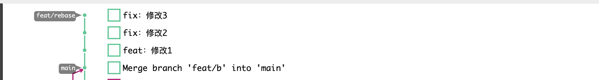
3. 提交记录太冗余了，就想压缩合并成一次；
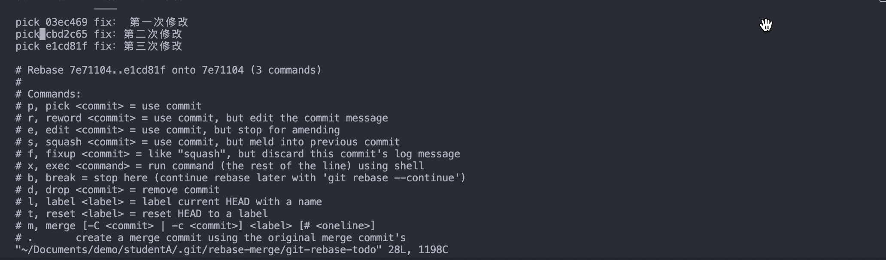
4. 把本地三次提交整合成一个；
```
git rebase -i HEAD~3
```

5. 想要合并这一堆更改，我们要使用 Squash 策略进行合并，即把当前的 commit 和它的上一个 commit 内容进行合并， 大概可以表示为下面这样，在交互模式的 rebase 下，至少保留一个 pick，否则命令会执行失败,注意顺序很重要。

```
pick  ... ...
s     ... ... 
s     ... ... 
s     ... ... 
```

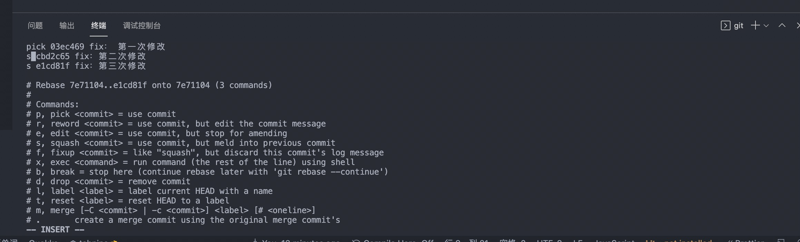

6. 修改文件后 按下 : 然后 wq 保存退出，此时又会弹出一个编辑页面，这个页面是用来编辑提交的信息，修改为 feat: 汇总修改，最后保存一下.
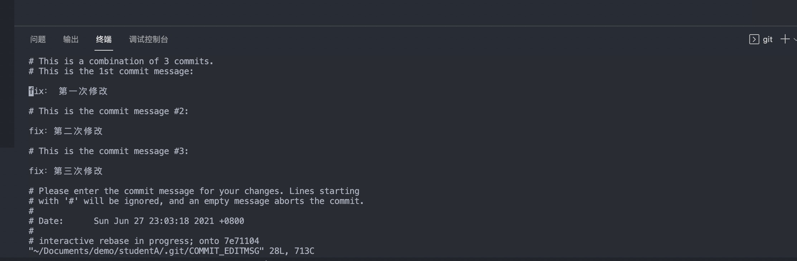

7. 接着使用 git branch 查看提交的 commit 信息，rebase 后的提交记录如下图所示，是不是清爽了很多？rebase 操作可以让我们的提交历史变得更加清晰。
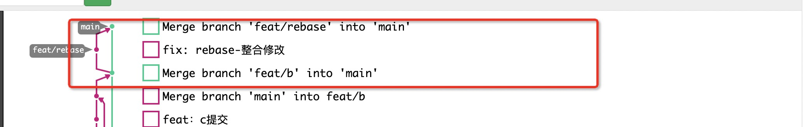


特别注意，只能在自己使用的 feature 分支上进行 rebase 操作，不允许在集成分支上进行 rebase，因为这种操作会修改集成分支的历史记录。


总结：

1. 当需要保留详细的合并信息的时候建议使用git merge；
2. 当发现自己修改某个功能时，频繁进行了git commit提交时，发现其实过多的提交信息没有必要时，可以尝试git rebase；

tips:

HEAD^和HEAD~有啥区别？

乔恩·勒利杰的[插图](https://mirrors.edge.kernel.org/pub/software/scm/git/docs/git-rev-parse.html)描述的很好描述得很好

```
主线流程 G -》 D -》 B -》 A

G   H   I   J
 \ /     \ /
  D   E   F
   \  |  / \
    \ | /   |
     \|/    |
      B     C
       \   /
        \ /
         A
A =      = A^0
B = A^   = A^1     = A~1
C =      = A^2
D = A^^  = A^1^1   = A~2
E = B^2  = A^^2
F = B^3  = A^^3
G = A^^^ = A^1^1^1 = A~3
H = D^2  = B^^2    = A^^^2  = A~2^2
I = F^   = B^3^    = A^^3^
J = F^2  = B^3^2   = A^^3^2
```

## git reset(重置)
如果因为某些原因（比如新提交导致了 BUG，或只是一个 WIP 提交），需要撤回提交，那么可以使用 git reset 指令。 git reset 可以控制当前分支回撤到某次提交时的状态。

### 软重置

```
git reset --soft HEAD~n
```

以下图为例：`9e78i` 提交添加了 `style.css` 文件，`035cc` 提交添加了 `index.js` 文件。使用软重置，我们可以撤销提交记录，但是保留新建的 `style.css` 和 `index.js` 文件。


使用 `git status` 指令查看，发现新建的 `style.css` 和 `index.js` 的两个文件还在，不过对应的提交记录已经移除。我们可以对这些文件内容重新编辑，稍后再做提交。

### 硬重置（慎重操作）

```
git reset --hard HEAD~n
```

有时重置时，无需保留提交已有的修改，直接将当前分支的状态恢复到某个特定提交下，这种重置称为硬重置，需要注意的是，硬重置还会将当前工作目录（working directory）中的文件、已暂存文件（staged files）全部移除！


使用 git status 查看，发现当前操作空间空空如也。Git 丢弃了 9e78i 和 035cc 两次提交引入的修改，将仓库重置到 ec5be 时的状态。

## git revert(还原)

```
git revert 撤销某次操作，此操作不会修改原本的提交记录，而是会新增一条提交记录来抵消某次操作。
```

举个例子，我们在 ec5be 上添加了 index.js 文件。之后发现并不需要这个文件。那么就可以使用 git revert ec5be 指令还原之前的更改。


新的提交记录 9e78i 还原了 ec5be 引入的更改。git revert 可以在不修改分支历史的前提下，还原某次提交引入的更改。

git revert 也可以回滚多次的提交

语法：`git revert [commit-id1] [commit-id2] ... `注意这是一个前开后闭区间，即不包括 commit1 ，但包括 commit2 。

使用场景：

1. 项目项目测试中中，测试说要你修改一个历史遗留bug（功能不复杂，但是涉及多个地方）
2. 你改完提交commit，然后上线的时候，测试说不上了，修复的bug可能需要依赖第三方接口，没协调好，下一版本上；
3. 一般人就手动改回来，这个时候就可以使用git revert；

或者正常上线项目，发现刚上线的代码有问题，需要项目回滚，前期提交`git rebase`规范只有一条commit记录，使用`git revert`有奇效，


tips:
`git rebase`和 `git revert`概念和使用场景区别？

* git revert 会新建一条 commit 信息，来撤回之前的修改。

*  git reset 会直接将提交记录退回到指定的 commit 上。

* 对于个人的 feature 分支而言，可以使用 git reset 来回退历史记录，之后使用 git push --force 进行推送到远程

* 但是如果是在多人协作的集成分支上，不推荐直接使用 git reset 命令，而是使用更加安全的 git revert 命令进行撤回提交。这样，提交的历史记录不会被抹去，可以安全的进行撤回，对于其他人代码提交无影响。

### git stash（暂存文件）

基本命令

```
git stash //把本地的改动暂存起来
git stash save "message" 执行存储时，添加备注，方便查找。
git stash pop // 应用最近一次暂存的修改，并删除暂存的记录
git stash apply  // 应用某个存储,但不会把存储从存储列表中删除，默认使用第一个存储,即 stash@{0}，如果要使用其他个，git stash apply stash@{$num} 。
git stash list // 查看 stash 有哪些存储
git stash clear // 删除所有缓存的 stash
```

使用场景

1. 现在你正在用你的 fate 分支上开发新功能,开发到一半。

2. 这时，生产环境上出现了一个 bug 需要紧急修复，但是你这部分代码还没开发完，不想提交，怎么办？

3. 这个时候可以用 git stash 命令先把工作区已经修改的文件暂存起来，然后切换到 hotfix 分支上进行 bug 的修复，修复完成后，切换回 feature 分支，从堆栈中恢复刚刚保存的内容。

4. 或者你在修复bug过程，比较着急，直接在测试问题改动，这个时候也可以使用git stash,将代码存储，切换到修复分支弹出；

## git reflog

每个人都会犯错，举一个例子：假设你不小心使用 git reset 命令硬重置仓库到某个提交。后面突然想到，重置导致了一些已有的正常代码的误删！
git reflog 是一个非常有用的命令，用于显示所有已执行操作的日志！包括合并、重置、还原：基本上记录了对分支的任何更改。

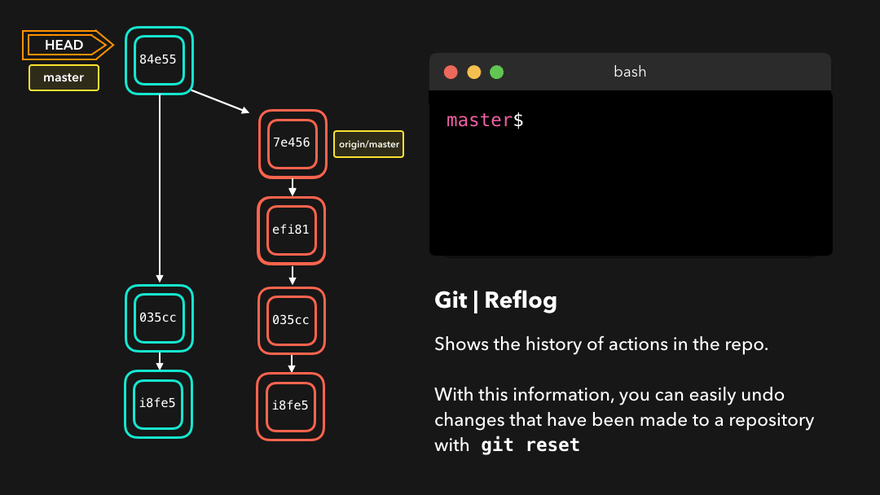

如果你不幸犯错了，你可以使用 git reflog 的信息通过重置 HEAD 轻松地重做此操作！

使用场景：

比如，你和同事一起协作开发功能，准备上线，合并好代码，突然，同事的功能依赖的接口无法上线，只需要上线你的功能，这个时候就可以使用`git reflog`。

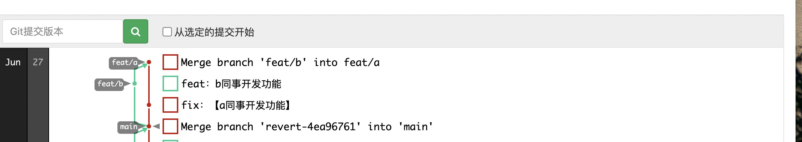

我们不想合并 feat/b 分支了。执行 git reflog 命令，我们看到合并之前的仓库状态位于 HEAD@{1} 这个地方

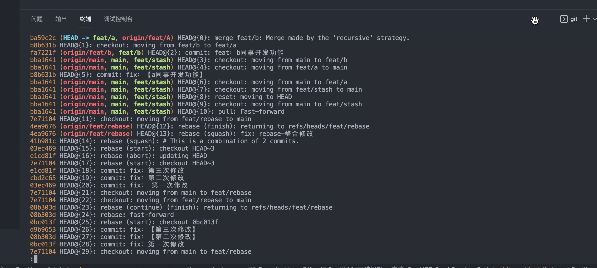

我们使用 git reset 指令将 HEAD 头指向 HEAD@{1},即可撤回操作。

```
git reset HEAD@{1}
```

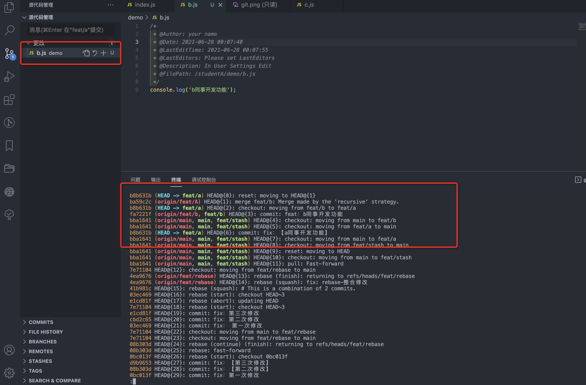

有同事可能想，还没有我手动删除`b.js`文件块？但是如果feat/b涉及几十个文件的变更呢？

## git cherry-pick(检出提交)

语法：
```
git cherry-pick [commit-hash]
```

多个 cherry-pick 需要同步到目标分支;

```
git cherry-pick <first-commit-id>...<last-commit-id>
```

请注意这是一个左开右闭的区间，也就是说 `first-commit-id`提交带来的代码的改动不会被合并过去，如果需要合并过去，可以使用`git cherry-pick <first-commit-id>^...<last-commit-id>`，它表示包含 `first-commit-id` 到 `last-commit-id` 在内的提交都会被合并过去。

如果某个分支上的某次提交的修改正是当前分支需要的，那我们可以使用 cherry-pick 命令检出某次的提交更改作为新的提交添加到当前分支上面。

举个例子（如下图所示）：dev 分支上的 76d12 提交添加了 index.js 文件，我们需要将本次提交更改加入到 master 分支，那么就可以使用 git cherry-pick 76d12 单独检出这条记录修改。


现在 master 分支包含了 76d12 中引入的修改，并添加了一条提交记录 9e78i。

使用场景：

1. A和B同事分别在feat/chert1和feat/chert2分支开发,提交记录如下，都有修复bug的fix记录和开发新功能的feat记录；

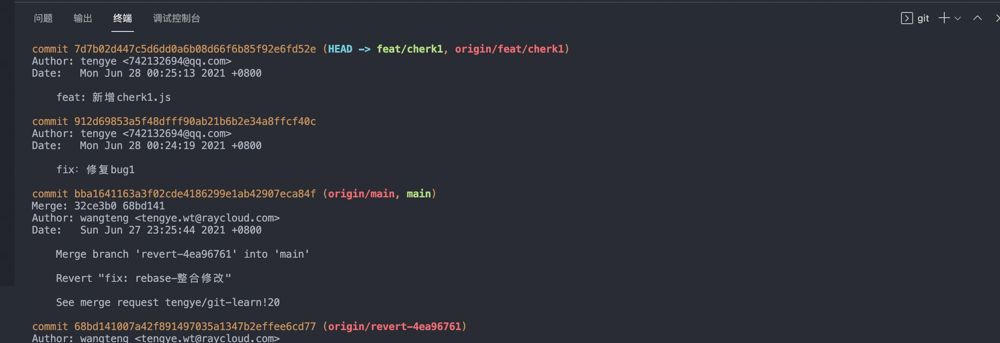

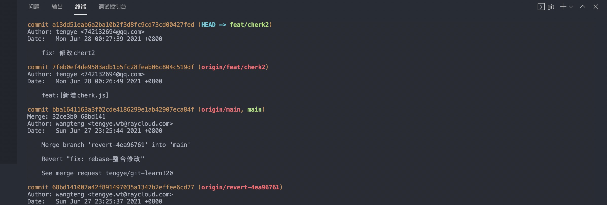

2. 现在为了产品觉得新功能开发比较久，临死决定先上修复bug的需求，需要把A和B的修复bug先上，功能开发后上；

3. 这个时候，就需要用到`git cherry-pick`,从main主分支切换一个`feat/debug`分支，用来检出两个分支的fix提交.现在，依次执行以下两条指令 `git cherry-pick 912d698`、`git cherry-pick a13dd51`，过程中，如果出现冲突，解决冲突后 进行 git add ，接着执行 `git cherry-pick --continue`。

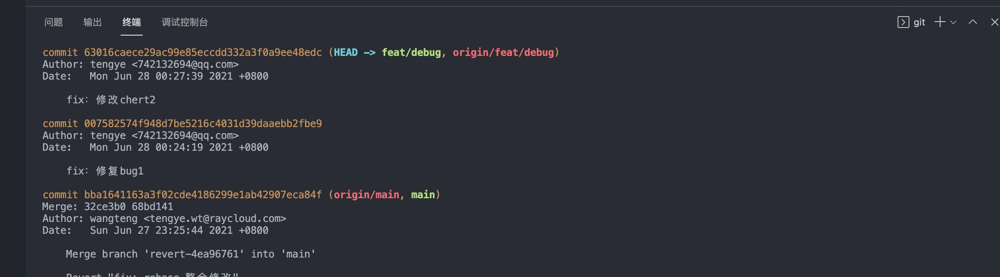

4.最后，main 上的提交如下

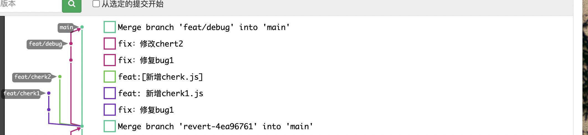

## 不同的工作区域撤销更改

```
// 工作区
// 如果修改了文件，想将它还原；
git checkout -- <filename>
// 如果修改了许多文件，想将它全部还原；
git checkout .

// 如果该文件进了暂存区，这部分文件我们不想要的话；
git reset <filename>
// 如果都不想要
git reset

// 如果文件进了本地仓库，需要回退
git reset HEAD~n

// 如果进了远程仓库，需要回退
git revert
```


## git alias (提升工作效率)

```
$ git config --global alias.ck checkout
$ git config --global alias.cm commit
$ git config --global alias.br branch
```

我的配置:
```
[alias]
ck = checkout
br = branch
mg = merge
cm = commit
last = log -1 HEAD
latest = for-each-ref --sort=-committerdate --format=\"%(committername)@%(refname:short) [%(committerdate:short)] %(contents)\"
ls = log --pretty=format:\"%C(yellow)%h %C(blue)%ad %C(red)%d %C(reset)%s %C(green)[%cn]\" --decorate --date=short
hist = log --pretty=format:\"%C(yellow)%h %C(red)%d %C(reset)%s %C(green)[%an] %C(blue)%ad\" --topo-order --graph --date=short
lg = log --color --graph --pretty=format:'%Cred%h%Creset -%C(yellow)%d%Creset %s %Cgreen(%cr) %C(bold blue)<%an>%Creset' --abbrev-commit
```

## 已结束
